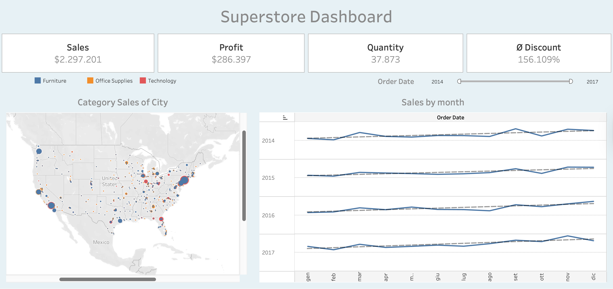

# Superstore Sales

Interactive Tableau dashboard analyzing sales, profit, and discounts from the Superstore dataset (2014–2017), highlighting temporal trends, seasonal patterns, and geographical insights.

My `Superstore_Dashboard.twbx` file is not included in this repository due to format and licensing; the README explains all steps and insights.

## Project Objective
The goal of this project was to apply Tableau skills by creating an interactive dashboard using the **Superstore dataset from Tableau**, which contains financial data for a fictional US retailer.  
The focus of the analysis was to understand sales, discounts, quantity, and profit trends from **2014 to 2017**, with attention to geographical and temporal patterns.

## Dataset
- **Source:** Superstore dataset from Tableau  
- **File:** Excel containing three tables: `Orders`, `Returns`, `People`  
- **Table used:** `Orders`  
- **Time period:** 2014 – 2017  
- **Key fields:**  
  - `Order Date`  
  - `Sales`  
  - `Discount`  
  - `Quantity`  
  - `Profit`  
  - `Category`  
  - `City`, `State`, `Country`

## Main Steps
1. **Data import** into Tableau, selecting the `Orders` table.  
2. **Data exploration and cleaning:** checking data types and missing values.  
3. **Creating aggregated measures:**
   - Total *Sales* (`SUM(Sales)`)  
   - Total *Discount* (`SUM(Discount)`) as percentage  
   - Total *Quantity* (`SUM(Quantity)`)  
   - Total *Profit* (`SUM(Profit)`)  
4. **Building key visualizations:**
   - **Category Sales by City (Geographic Map):**  
     - Columns → Longitude  
     - Rows → Latitude  
     - Color → `Category` (*Furniture*, *Office Supplies*, *Technology*)  
     - Size → `SUM(Sales)`  
     - Detail → `City`, `State`, `Country`  
     - Filter → `SUM(Sales)`  
   - **Sales by Month:**  
     - Columns → Month (`MONTH(Order Date)`)  
     - Rows → Year (`YEAR(Order Date)`)  
     - Value → `SUM(Sales)`  
     - Chart type → Line graph  
     - Filter → `YEAR(Order Date)`

## Dashboard
The dashboard combines the key visualizations to provide an overview of sales performance over time and across regions, with filters for year and product category.

## Key Insights
- Sales show a steady growth from 2014 to 2017.  
- Sales follow a recurring **seasonal pattern**:  
  - lowest point in February  
  - increase until March  
  - dip in summer (July/August)  
  - rise in September  
  - another drop in October  
  - peak in November, consistent across all years except 2017, where sales decrease after November  
- The *Technology* category is the most profitable, with higher average profits.  
- Coastal regions (East and West) generate higher sales volumes compared to central states.

